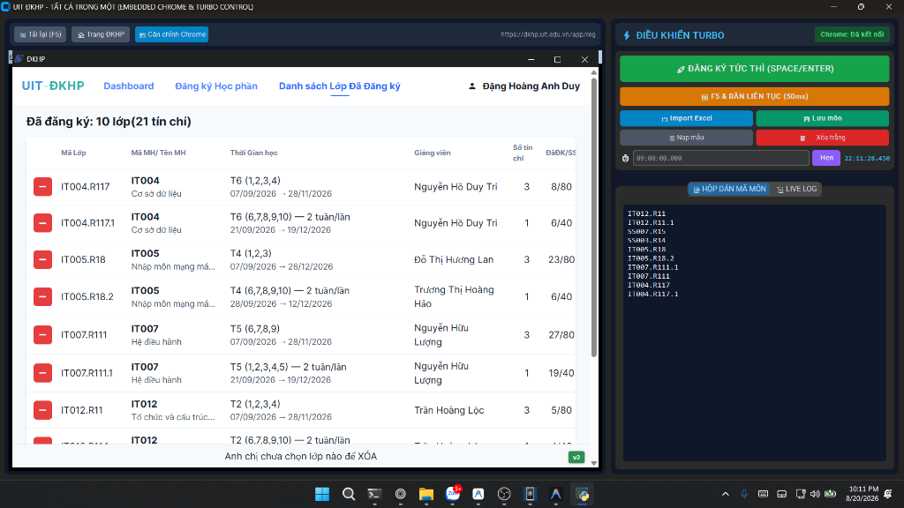

# UIT ĐKHP - TẤT CẢ TRONG MỘT (EMBEDDED CHROME & TURBO CONTROL) ⚡

Công cụ hỗ trợ đăng ký học phần UIT siêu tốc độ thông qua Chrome DevTools Protocol (CDP) WebSocket với giao diện đồ họa **All-in-One: Nhúng trực tiếp Chrome & Điều khiển Turbo**.

---

## 📸 Ảnh minh họa giao diện



---

## 🌟 Tính năng nổi bật

- **🌐 Nhúng Chrome trực tiếp (All-in-One)**:
  - Tự động mở và nhúng cửa sổ Chrome vào khung bên trái (chiếm ~78% chiều rộng màn hình).
  - Tự động điền tài khoản, mật khẩu sinh viên vào cổng đăng ký.
  - Nhận diện chính xác tiến trình `chrome.exe`, chống bắt nhầm các cửa sổ ứng dụng khác (IDE, VS Code,...).
- **🖥️ Mở toàn màn hình (Max Screen)**:
  - Giao diện tự động phóng to tối đa khi khởi động để hiển thị đầy đủ bảng học phần.
  - Hỗ trợ phím tắt **`F11`** bật/tắt chế độ Fullscreen không viền.
- **🚀 Bắn lệnh siêu tốc (Hotkey: `SPACE` / `ENTER`)**:
  - Gửi lệnh trực tiếp qua WebSocket CDP tới tab ĐKHP với độ trễ < 2ms.
  - Tự động tick toàn bộ các mã môn trong danh sách và bấm nút Đăng ký ngay lập tức.
- **⚡ Tối ưu bấm nút Đăng ký 0ms (Instant Click)**:
  - Bỏ delay cuộn trang, dùng native setter React và kích hoạt micro-burst đón đầu cập nhật DOM của React.
- **🔄 F5 & Bắn liên tục (Loop 50ms - Phím tắt `F5`)**:
  - Vừa reload trang vừa lặp lại thao tác quét và bắt bảng học phần liên tục mỗi 50ms khi cổng chuẩn bị mở.
- **👤 Cấu hình & Đổi tài khoản linh hoạt**:
  - Dễ dàng thay đổi MSSV và mật khẩu ngay trong tab **👤 TÀI KHOẢN** hoặc nút **👤 Tài khoản** trên thanh điều hướng.
  - Tự động lưu vào `config.json` và tự điền khi vào cổng ĐKHP.
- **📁 Import Excel / TXT / CSV**:
  - Tự động quét và trích xuất mã lớp học phần từ file Excel (`.xlsx`, `.xls`), CSV hoặc Text.
- **⏱️ Hẹn giờ kích hoạt chính xác mili-giây**:
  - Nhập mốc thời gian (ví dụ `08:59:59.950`), đến đúng thời điểm ứng dụng sẽ tự động kích hoạt bắn lệnh.
- **📜 Live Log thời gian thực**:
  - Hiển thị chi tiết từng mili-giây các môn đã tick mới, môn đã có sẵn hoặc môn chưa tìm thấy.

---

## 🛠️ Cài đặt

Mở PowerShell tại thư mục dự án và thực hiện các bước sau:

```powershell
# 1. Tạo môi trường ảo
python -m venv .venv

# 2. Kích hoạt môi trường ảo
.\.venv\Scripts\Activate.ps1

# 3. Cài đặt các thư viện cần thiết
pip install -r requirements.txt
```

---

## 🚀 Hướng dẫn sử dụng

### Cách 1: Sử dụng Giao diện Đồ họa GUI (Khuyên dùng)

- **Cách nhanh**: Click đúp vào file **`run.bat`** để chạy tool.
- Hoặc chạy lệnh qua PowerShell:
  ```powershell
  .\.venv\Scripts\python.exe gui.py
  ```

1. **Khởi động**: Ứng dụng tự động mở ở chế độ Max Screen và nhúng tab Chrome ĐKHP vào khung bên trái.
2. **Tài khoản**: Chuyển sang tab **👤 TÀI KHOẢN** hoặc bấm nút **👤 Tài khoản** để lưu thông tin MSSV/Mật khẩu của bạn.
3. **Đăng nhập**: Nhập Captcha trong khung Chrome (nếu có) và bấm Đăng nhập.
4. **Quản lý môn học**: Dán danh sách mã môn vào ô văn bản hoặc bấm **📁 Import Excel** để nạp danh sách lớp. Bấm **💾 Lưu môn**.
5. **Kích hoạt đăng ký**:
   - **Bắn tức thì**: Nhấn phím **`SPACE`** hoặc **`ENTER`** (hoặc bấm nút màu xanh **🚀 ĐĂNG KÝ TỨC THÌ**).
   - **F5 & Bắn lặp liên tục**: Nhấn phím **`F5`** (hoặc bấm nút màu cam **🔄 F5 & BẮN LIÊN TỤC**).
   - **Hẹn giờ tự động**: Nhập mốc giờ (ví dụ `08:59:59.900`) và bấm **Hẹn**.

---

### Cách 2: Sử dụng dòng lệnh Terminal (CLI)

Chạy lệnh:
```powershell
.\.venv\Scripts\python.exe inject-hoc-phan.py
```

- Nhấn **`[ENTER]`**: Bắn lệnh tức thì.
- Gõ **`f`** + **`[ENTER]`**: F5 tải lại trang & bắn liên tục.
- Gõ **`auto`** + **`[ENTER]`**: Bắn lặp mỗi 50ms.
- Gõ **`r`** + **`[ENTER]`**: Nạp lại file `mon-hoc.txt`.

---

### Cách 3: Sử dụng Bookmarklet / DevTools Console

Copy toàn bộ mã trong file [`scripts.js`](./scripts.js) và dán trực tiếp vào **DevTools Console (F12)** trên tab ĐKHP để chạy tức thì 0ms.
