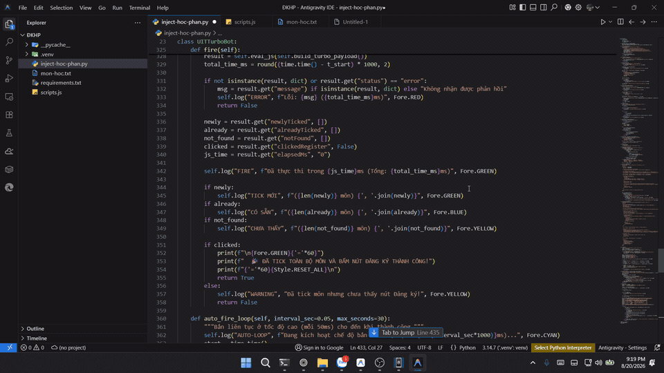

# UIT ĐKHP - TURBO ENGINE ⚡

Công cụ hỗ trợ đăng ký học phần UIT siêu tốc độ qua Chrome DevTools Protocol (CDP) WebSocket với giao diện đồ họa **GUI chia đôi màn hình (Side-by-Side)**.

---

## 🎥 Video hướng dẫn



---

## 🌟 Tính năng nổi bật

- **Giao diện đồ họa GUI (Dark Mode)**:
  - 🌐 **Nút Mở Chrome & Snap 1 bên**: Tự mở Chrome và căn chỉnh màn hình (Trái: Chrome 60%, Phải: Bảng điều khiển 40%).
  - 📋 **Hộp nhập liệu đa năng**: Dán danh sách mã môn tự do (dòng mới, dấu phẩy, khoảng trắng).
  - 📁 **Import Excel / TXT / CSV**: Tự động quét và lọc mã lớp học phần từ file Excel (`.xlsx`, `.xls`), CSV, Text.
  - 🚀 **Bắn lệnh siêu tốc (Hotkey: `SPACE` / `ENTER`)**: Độ trễ WebSocket < 2ms.
  - 🔄 **F5 & Bắn lặp liên tục (Loop 50ms)**: Vừa reload trang vừa bắt bảng học phần.
  - ⏱️ **Hẹn giờ kích hoạt chính xác mili-giây**: Đặt giờ (ví dụ `09:00:00.000`), đến đúng giờ tool tự động bắn lệnh.
  - 📜 **Live Terminal Log**: Theo dõi thời gian thực từng mili-giây.

---

## 🛠️ Cài đặt

Mở PowerShell tại thư mục dự án và chạy:

```powershell
# 1. Tạo môi trường ảo
python -m venv .venv

# 2. Kích hoạt môi trường ảo
.\.venv\Scripts\Activate.ps1

# 3. Cài đặt các thư viện cần thiết
pip install -r requirements.txt
```

---

## 🚀 Hướng dẫn sử dụng

### Cách 1: Sử dụng Giao diện Đồ họa GUI (Khuyên dùng)

Chạy lệnh:
```powershell
.\.venv\Scripts\python.exe gui.py
```

1. **Nhập mã môn**: Dán trực tiếp vào ô văn bản hoặc bấm **📁 Import Excel / File** để chọn file Excel/TXT. Bấm **💾 Lưu danh sách**.
2. **Mở Chrome**: Bấm **🌐 MỞ CHROME & SNAP 1 BÊN**. Chrome sẽ mở bên trái và tự điền tài khoản, mật khẩu.
3. **Đăng nhập**: Nếu có Captcha, nhập Captcha trên màn hình Chrome và bấm Đăng nhập.
4. **Bắn lệnh**:
   - **Cách 1**: Đến giờ mở cổng, nhấn phím **`SPACE`** hoặc **`ENTER`** hoặc bấm nút màu xanh **🚀 ĐĂNG KÝ TỨC THÌ**.
   - **Cách 2**: Bấm **🔄 F5 & BẮN LIÊN TỤC (50ms)** nếu cổng đang mở dần.
   - **Cách 3**: Nhập giờ vào ô hẹn giờ (ví dụ `08:59:59.900`) và bấm **Đặt giờ**.

---

### Cách 2: Sử dụng dòng lệnh Terminal (CLI)

Chạy lệnh:
```powershell
.\.venv\Scripts\python.exe inject-hoc-phan.py
```

- Nhấn **`[ENTER]`**: Bắn lệnh tức thì.
- Gõ **`f`** + **`[ENTER]`**: F5 tải lại trang & bắn liên tục.
- Gõ **`auto`** + **`[ENTER]`**: Bắn lặp mỗi 50ms.
- Gõ **`r`** + **`[ENTER]`**: Nạp lại file `mon-hoc.txt`.

---

### Cách 3: Sử dụng trực tiếp trên Console trình duyệt (Bookmarklet)

Copy toàn bộ mã trong file [`scripts.js`](./scripts.js) và dán trực tiếp vào **DevTools Console (F12)** trên tab ĐKHP để chạy tức thì 0ms.
